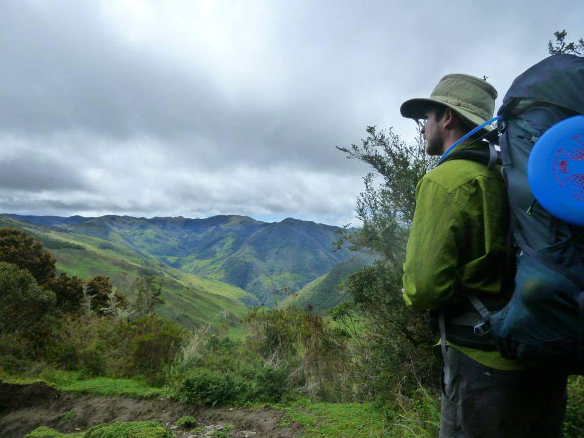

\
\
```{r,out.width = "400px",dpi = 600,align = "center", out.extra = 'style="display:block; margin:auto; padding:2px; background-color:#000000"', echo=FALSE}

```

I am currently a post-doctoral researcher at the RiverLy research unit at [INRAe](https://riverly.inrae.fr/en/home) with the [EcoFlows team](https://ecoflows.inrae.fr/)
in Lyon, France, with [Dr. Florentina Moatar](https://scholar.google.fr/citations?user=LzbYKSAAAAAJ&hl=en&oi=ao) and 
[Dr. Gilles Pinay](https://scholar.google.fr/citations?hl=en&user=gZAJ_rQAAAAJ). 
We are studying 
[stream and river metabolism](https://en.wikipedia.org/wiki/Stream_metabolism), 
and how it evolves through river networks. 

We are currently focused on two major themes: 

1) How are major changes to river ecological state, like clear water changing to murky water,
linked to changes in ecological processes, like how much carbon is processed in the river?

2) How does river network structure, like the number of confluences and their orientation,
influence ecological processes?

Both themes advance our understanding of how rivers and river networks transport, process,
and transform elements like carbon and nitrogen. 

