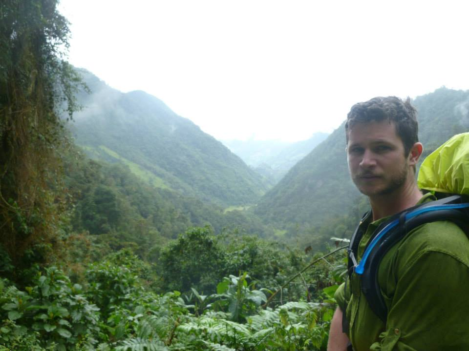

\
\
```{r,out.width = "400px",dpi = 600,align = "right", out.extra = 'style="display:block; margin:auto; padding:2px; background-color:#000000"', echo=FALSE}

```

## Greetings

Hope you are well reading this. My name is Jake and I am an [ecosystem ecologist](https://en.wikipedia.org/wiki/Ecosystem_ecology). I'm interested in questions like:

1. How do ecosystems [self-organize](https://en.wikipedia.org/wiki/Self-organization)?
2. What can [emergent properties](https://en.wikipedia.org/wiki/Emergence#Emergent_structures_in_nature) of ecosystems tell us about their internal processes?
3. How can we use our understanding of ecosystems to improve [resource management](https://en.wikipedia.org/wiki/Environmental_resource_management) and human health?

I typically think about these questions through the lenses of hydrology, systems ecology, and biogeochemistry.

Thank you for visiting!

**Contact:** diamondjacob [at] gmail [dot] com
