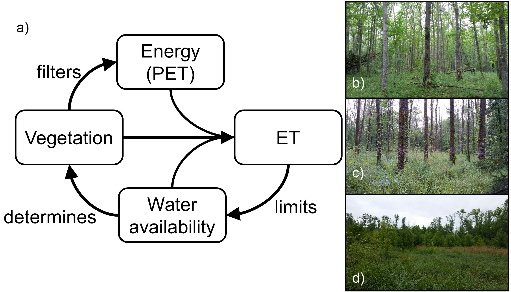
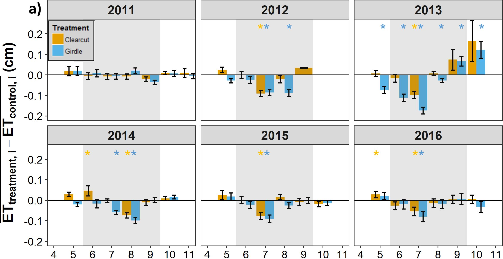
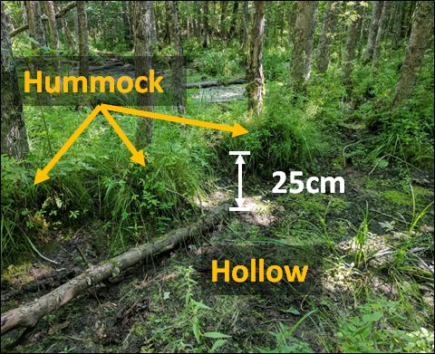
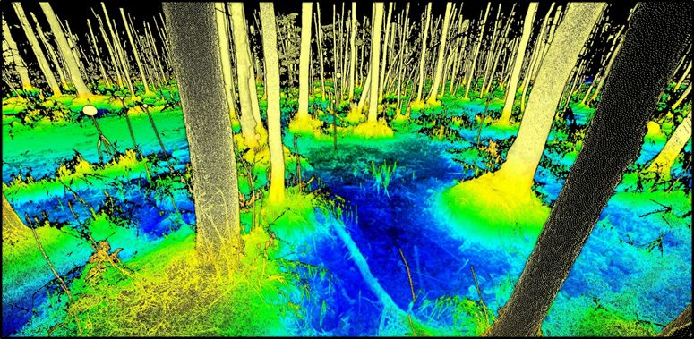
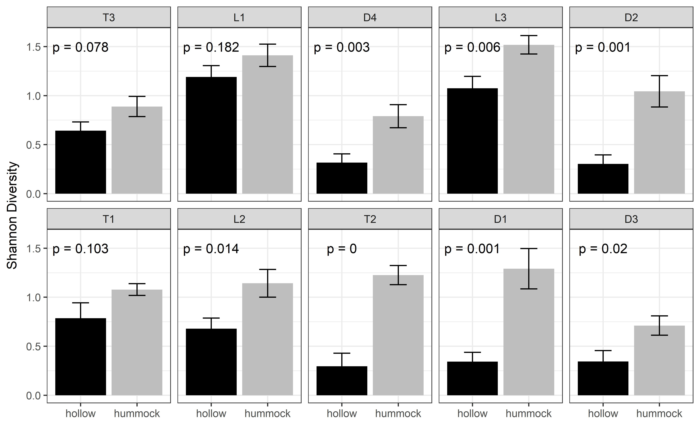
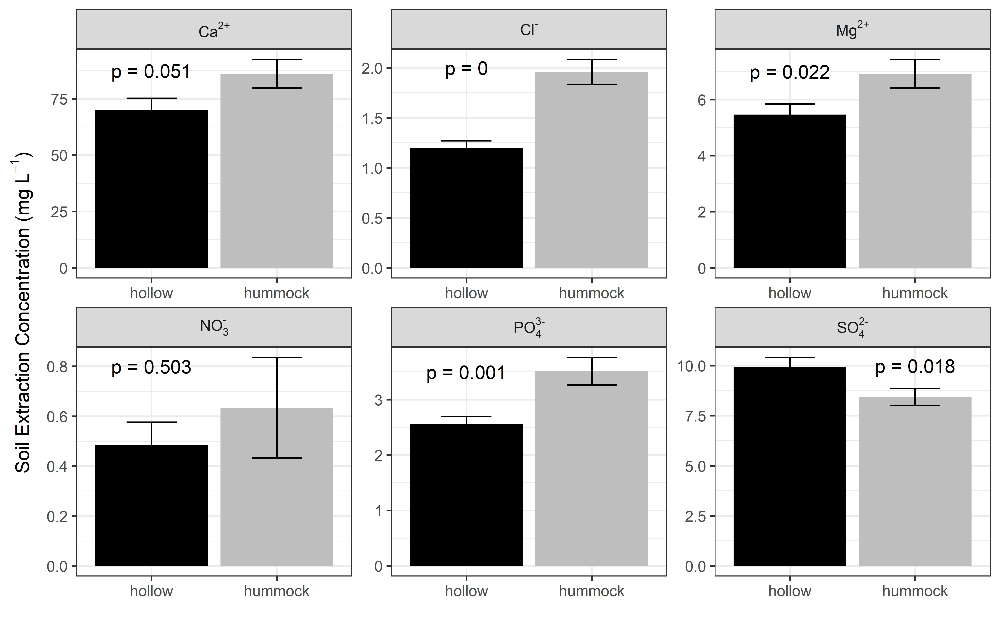
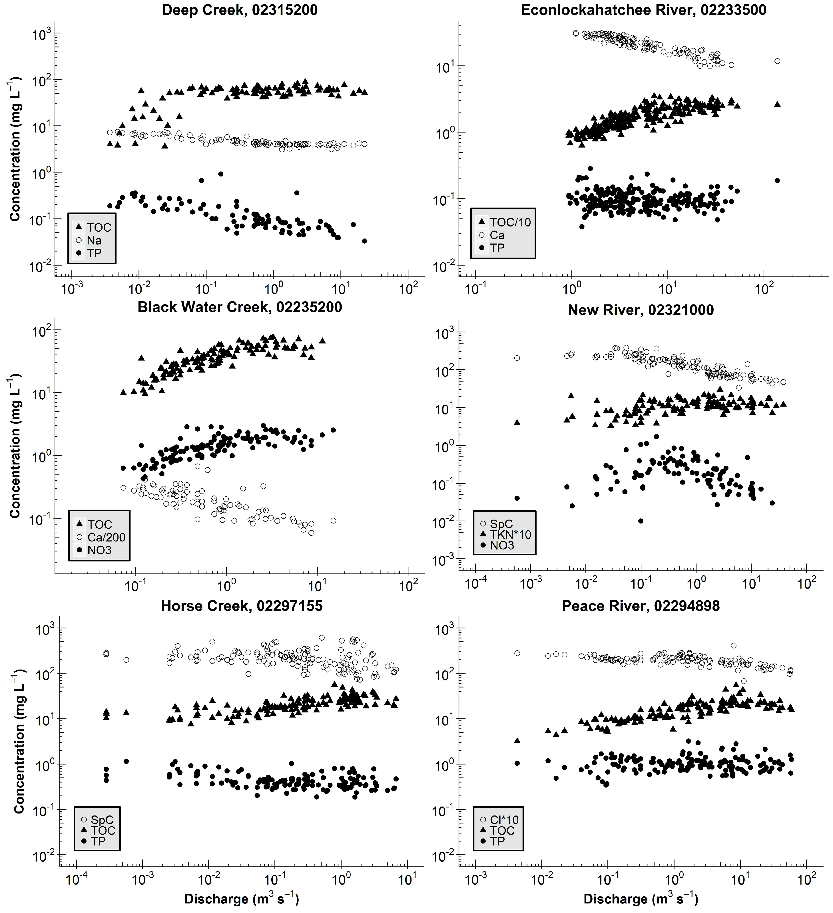
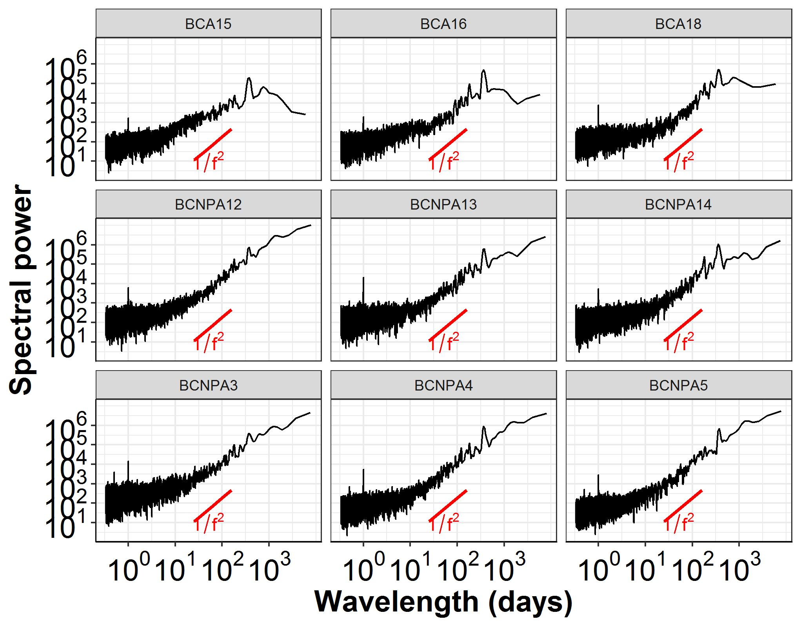
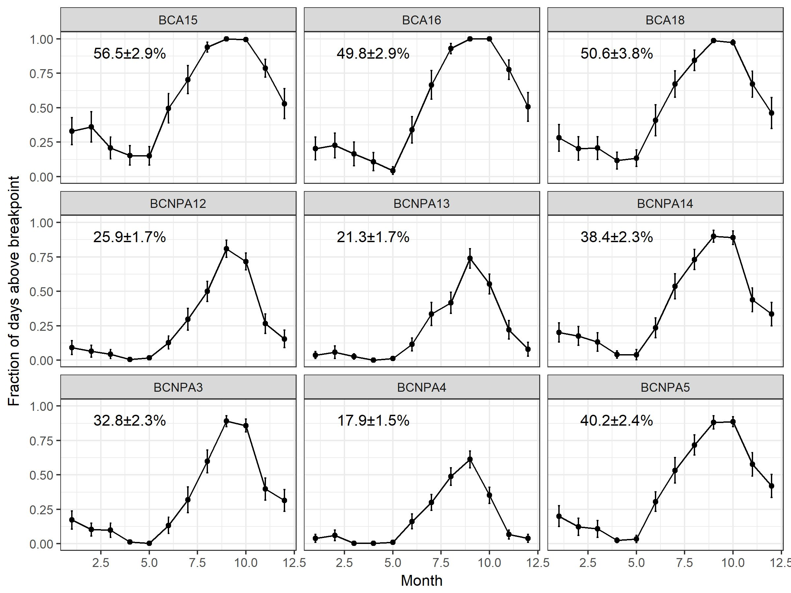

<center>[Google Scholar](https://scholar.google.com/citations?user=BsBmdAUAAAAJ&hl=en)  
[Research Gate](https://www.researchgate.net/profile/Jacob_Diamond)  
[ORCID: 0000-0002-5392-5707](http://orcid.org/0000-0002-5392-5707)  
All figures and results presented here are my own work, conducted (in [R](https://www.r-project.org/)) in close collaboration with several colleagues and mentors.
</center> 

***

# **Ecohydrology**

[Ecohydrology](https://en.wikipedia.org/wiki/Ecohydrology) essentially asserts that biota and the hydrologic cycle are *fundamentally interconnected* through local and global reciprocal feedbacks. This idea is so intriguing to me! 

## Plant-water Interactions and Disturbance

<div style= "float:left;position: relative;margin-right: 20px">
```{r,out.width = "400px",dpi = 600, out.extra = 'style="display:block;padding:1px; background-color:#000000"', echo=FALSE}

```
\
```{r,out.width = "400px",dpi = 600, out.extra = 'style="display:block;padding:1px; background-color:#000000"', echo=FALSE}

```
</div>
The invasive pest, the [emerald ash borer](http://www.emeraldashborer.info/), is causing large-scale loss of [ash trees](https://en.wikipedia.org/wiki/Fraxinus) in North America, with important consequences for forestry, aesthetics, and ecosystem functioning. For the first chapter of my dissertation, I analyzed the ecohydrologic impacts of forest loss for the unique and beautiful [black ash](https://en.wikipedia.org/wiki/Fraxinus_nigra) wetlands. We found three main things:  

1. evapotranspiration (ET) limits the amount of water in black ash wetlands, and 
2. ET is uniquely determined by vegetation type and physical structure, but more interestingly,  
3. when black ash is lost, a wetter and more marsh-like ecosystem persists, with implications for an [alternative stable state](https://en.wikipedia.org/wiki/Alternative_stable_state). 

You can read about it [here](./docs/Diamond et al. (2018).pdf).  

**Co-authors:**  
[Daniel McLaughlin](https://frec.vt.edu/people/McLaughlin.html)  
[Rob Slesak](https://mn.gov/frc/rob-slesak.html)  
[Anthony D'Amato](http://www.uvm.edu/rsenr/tonydamato/)  
[Brian Palik](https://www.nrs.fs.fed.us/people/Palik)  

Project funded by the Minnesota Environmental and
Natural Resources Trust Fund, the USDA Forest Service Northern
Research Station, and the Minnesota Forest Resources Council.
Additional funding was provided by the Virginia Tech Forest Resources
and Environmental Conservation department, the Virginia Tech
Institute for Critical Technology and Applied Science, and the Virginia
Tech William J. Dann Fellowship.

***

## Wetland Microtopography {#anchormicro}

<div style= "float:right;position: relative;margin-left: 20px">
```{r,out.width = "400px",dpi = 600, out.extra = 'style="display:block;padding:1px; background-color:#000000"', echo=FALSE}

```
\
```{r,out.width = "400px",dpi = 600, out.extra = 'style="display:block;padding:1px; background-color:#000000"', echo=FALSE}

```
</div>

Decades of research suggest that microtopography---changes in ground elevation on the order of 10--100 cm---is an important feature of ecosystems, and particularly wetlands, around the world. For example, we know that high points in a wetland ("hummocks") have greater plant diversity, primary production, and nutrient concentrations than nearby low points ("hollows"). We also know that, under the right circumstances, spatial patterns of microtopography can emerge---a result of feedbacks that develop between biota, soil carbon, and hydrology. These observations, while interesting in their own right, also have important consequences for how we [scale](https://esajournals.onlinelibrary.wiley.com/doi/epdf/10.2307/1941447) from point measurements to ecosystem and global estimates.

I am exploring black ash wetland microtopography in detail as part of my dissertation work, and we've been using a novel LiDAR method called Terrestrial Laser Scanning (TLS) with my collaborator [Atticus Stovall](https://atticusstovall.wordpress.com/) at the University of Virginia. We have recently:

1. published the algorithm to extract microtopography from TLS data
2. analyzed the geospatial structure of microtopography
3. related this structure to measured [biogeochemical variables](#anchorbgc)

**Co-authors:**  
[Atticus Stovall](https://atticusstovall.wordpress.com/)  
[Daniel McLaughlin](https://frec.vt.edu/people/McLaughlin.html)  
[Rob Slesak](https://mn.gov/frc/rob-slesak.html)  

***

# **Biogeochemistry** {#anchorbgc} 

<div style= "float:left;position: relative;margin-right: 20px">
```{r,out.width = "400px",dpi = 600, out.extra = 'style="display:block;padding:1px; background-color:#000000"', echo=FALSE}

```
\
```{r,out.width = "400px",dpi = 600, out.extra = 'style="display:block;padding:1px; background-color:#000000"', echo=FALSE}

```
</div>

In wetland systems like the black ash swamps that we study, the ground surface is covered by an organic layer of [peat](https://en.wikipedia.org/wiki/Peat) or muck. The height (or depth) of this layer is a function of the balance between primary production and soil respiration. We commonly observe local high points ("hummocks") of this organic layer that are occupied by black ash trees, which led us to a hypothesis:

H: black ash trees "create" their own hummocks through an evapoconcentration positive feedback loop, like so:

1. black ash tree transpiration draws in dissolved nutrients from the surrounding area, which leads to 
2. greater local primary production, which leads to 
3. buildup of root mass/soil organic matter and also greater transpiration, which leads to 
4. nutrient accumulation, and so on.

As part of my dissertation work, I am testing this hypothesis by investigating [microtopography](#anchormicro) and wetland biogeochemical variables such as nutrients, vegetative diversity, and primary production.

Are plants actively changing their environment to their own advantage? ([Could be!](https://www.youtube.com/watch?v=CrrSAc-vjG4)) This is a very difficult question to answer, but this research may add another piece of evidence to our growing understanding of the agency of plants.

\ 

**Co-authors:**  
[Daniel McLaughlin](https://frec.vt.edu/people/McLaughlin.html)  
[Rob Slesak](https://mn.gov/frc/rob-slesak.html)  
[Atticus Stovall](https://atticusstovall.wordpress.com/)  

***

# **Hydrology**

## Watershed Hydrochemistry

<div style= "float:right;position: relative;margin-left: 20px">
```{r,out.width = "400px",dpi = 600, out.extra = 'style="display:block;padding:1px; background-color:#000000"', echo=FALSE}

```
</div>

Since the early days of watershed science, researchers have been fascinated with the concentration-discharge (C-Q) relationships of rivers and streams. The idea is simple enough: how does the chemical concentration of a material (e.g., nitrogen or sediment) change with the amount of water flowing in the river (aka "discharge")? Perhaps surprisingly, these C-Q relationships can tell us quite a bit about how, when, and where water is routed through, and stored by watersheds.

For my master's thesis, I analyzed long-term measurements of concentration and discharge for rivers and streams across Florida. I found consistent patterns in C-Q relationships, where the C-Q shape depended entirely on the type of material under consideration (e.g., organically-derived *versus* rock-derived), implying common hydrologic storage and transport across systems, regardless of size or location. Interestingly, I also found consistent "breaks" in many of the C-Q relationships, implying a watershed *switching behavior* in the source location for river water (e.g., deep aquifer storage *versus* shallow soil horizons). This information improves our understanding of the fate and transport of materials through watersheds, with implications for [predicting loads to downstream waterbodies](https://en.wikipedia.org/wiki/Total_maximum_daily_load).

You can read about it [here](./docs/Diamond and Cohen_2018.pdf).

**Co-authors:**  
[Matt Cohen](http://sfrc.ufl.edu/ecohydrology/)

Project funded by the  National Council for Air
and Stream Improvement, the Florida Forest Service, and the National
Institute of Food and Agriculture (NIFA) via CRIS project FLA‐FOR‐
005284.

***

## Wetlandscape Connectivity

<div style= "float:left;position: relative;margin-right: 20px">
```{r,out.width = "400px",dpi = 600, out.extra = 'style="display:block;padding:1px; background-color:#000000"', echo=FALSE}

```
\
```{r,out.width = "400px",dpi = 600, out.extra = 'style="display:block;padding:1px; background-color:#000000"', echo=FALSE}

```
</div>

A wetlandscape is a complex of all the wetlands within a drainage network. Most of the time, wetlands in a wetlandscape are disconnected from each other---they are geographically isolated. However, the timing, magnitude, and frequency of connections among wetlands in a wetlandscape has important implications for [policy and regulations](https://www.epa.gov/wotus-rule), ecosystem functioning, and also [ecosystem services](https://en.wikipedia.org/wiki/Ecosystem_services).

We are using high-frequency measurements of wetland stage (i.e., water-level) in geographically-isolated [cypress domes](https://www.google.com/search?q=cypress+domes&source=lnms&tbm=isch&sa=X&ved=0ahUKEwia6_2Yjs_cAhVLj1kKHbB5CFEQ_AUICigB&biw=1920&bih=898) in [Big Cypress National Preserve](https://www.google.com/maps/@26.0346239,-81.0811382,3853m/data=!3m1!1e3) in southwest Florida to develop a simple methodology for extracting:  

1. elevation thresholds of wetlandscape connectivity,
2. frequencies and timings of wetlandscape connectivity (i.e., when and how often are the wetlands connected to each other), and
3. magnitudes of hydrologic exchange among wetlands

**Co-authors:**  
[Daniel McLaughlin](https://frec.vt.edu/people/McLaughlin.html)  
[Matt Cohen](http://sfrc.ufl.edu/ecohydrology/)  
[Carlos Quintero](https://www.researchgate.net/profile/Carlos_Quintero24)
[Jim Heffernan](https://heffernanlab.weebly.com/)

